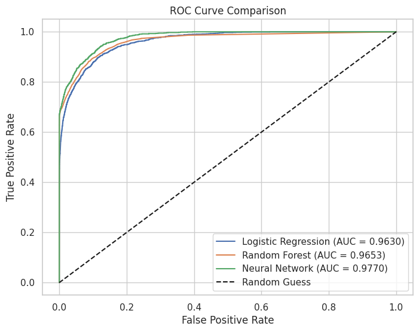
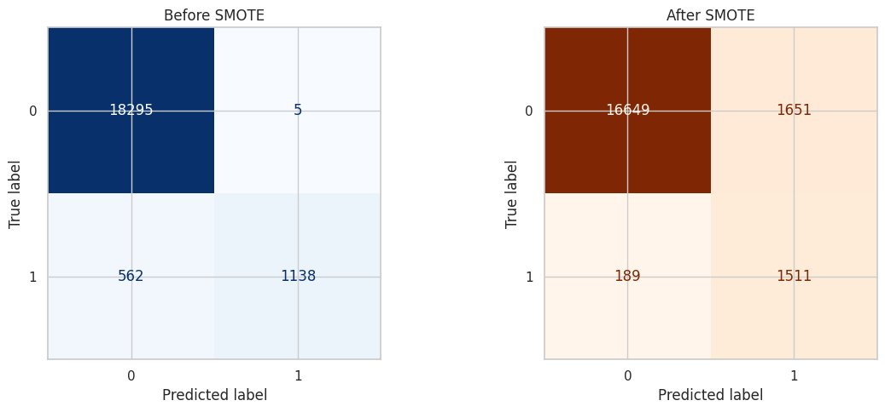

# Diabetes Prediction with Neural Networks

This repository contains a machine learning pipeline that uses a feedforward neural network and SMOTE to predict whether a patient is diabetic, based on a clinical dataset from the Kaggle challenge: [Diabetes Prediction with NN](https://www.kaggle.com/competitions/diabetes-prediction-with-nn).

---

## Overview

The objective of this project is to predict diabetes status (`1` = diabetic, `0` = non-diabetic) using structured clinical data such as glucose level, HbA1c, BMI, and other patient information. We approached this as a binary classification task using a feedforward neural network, while also evaluating baseline models like logistic regression and random forest. To address the significant class imbalance in the dataset, we applied the SMOTE (Synthetic Minority Oversampling Technique) algorithm.

### Dataset Summary

The dataset consists of approximately 25,000 patient records and includes 8 input features and 1 binary target variable:

| Feature                | Description                             |
|------------------------|-----------------------------------------|
| `gender`               | Categorical (Male, Female, Other)       |
| `age`                  | Age in years                            |
| `hypertension`         | 0 = No, 1 = Yes                          |
| `heart_disease`        | 0 = No, 1 = Yes                          |
| `smoking_history`      | Categorical (never, current, etc.)      |
| `bmi`                  | Body Mass Index                         |
| `HbA1c_level`          | Hemoglobin A1c level                    |
| `blood_glucose_level`  | Measured blood glucose level (numeric)  |
| `diabetes`             | Target label (0 = non-diabetic, 1 = diabetic) |

Note: The dataset is highly imbalanced — approximately 8.5% of the records correspond to diabetic patients.

### Best Model Performance (Neural Network with SMOTE)

- **Accuracy:** 97.2%  
- **AUC (ROC):** 0.9757  
- **AUC (Precision-Recall):** 0.8816

We also compared classical ML models (Logistic Regression, Random Forest) against the NN.

---

## Summary of Work Done

## Exploratory Data Analysis (EDA)

This is **exploratory data analysis (EDA)** aimed at:
- Understanding class imbalance
- Exploring distribution of key features (e.g., age, BMI, HbA1c)
- Identifying relationships between predictors and diabetes status
  
### Feature Distributions by Diabetes Status

The following plots illustrate how the distributions of key clinical features vary between diabetic (1) and non-diabetic (0) individuals, helping us visually assess patterns and class imbalance in the raw dataset.      (distribution plots (histograms + KDE curves) for several features, split by diabetes status)

- HbA1c Level & Blood Glucose Level: Both metrics show a strong separation between diabetic and non-diabetic individuals — diabetic cases tend to have consistently higher HbA1c and blood glucose values.

- Age: Diabetic cases increase noticeably in patients aged 50 and above, with a significant density peak in those aged 60+.

---

#### Preprocessing / Cleanup

The data was split into training and validation sets ising an 80/20 stratified split to preserve the original class distribution. Only the training set was resampled using SMOTE to correct the imbalance before training the neural networks.

- Dropped unnecessary columns
- One-hot encoding of categorical variables
- Scaled numeric features using StandardScaler
- Applied SMOTE to oversample the minority class (diabetic patients)
  
 ### Addressing Class Imbalance with SMOTE

Only ~8.5% of patients were labeled diabetic, which caused the model to under-predict the positive class. We used SMOTE (Synthetic Minority Over-sampling Technique) to rebalance the training data. This improved the model’s **recall** substantially while maintaining strong AUC performance.

---

#### Data Visualization

- Histograms for key features by diabetes status
- Class imbalance confirmed (~8.5% diabetic)
- Key predictors: HbA1c level, blood glucose level

---

### Problem Formulation

- **Input**: Standardized tabular data (numeric + encoded)
- **Output**: Binary prediction (diabetic or not)
- **Model**: Feedforward neural network
  - 64 → 32 → 1 architecture
  - ReLU activations, dropout = 0.3
- **Loss**: Binary Crossentropy
- **Optimizer**: Adam
- **Metrics**: Accuracy, AUC, Precision, Recall, F1

---

### Training

- **Platform**: Jupyter Notebook (local)
- **Packages**: TensorFlow, scikit-learn, imbalanced-learn, pandas, seaborn
- **Runtime**: ~1 min per model (CPU)
- **Training Duration**: Fixed 20 epochs
- **Stopping Rule**: Manual monitoring of overfitting via validation accuracy
- **Difficulties**: Class imbalance skewed precision and recall — resolved with SMOTE

---

### Performance Comparison

| Model                        | Accuracy | AUC    | Precision | Recall | F1 Score |
|-----------------------------|----------|--------|-----------|--------|----------|
| Logistic Regression         | 0.9605   | 0.9625 | 0.99      | 0.68   | 0.81     |
| Random Forest               | 0.9740   | 0.9613 | 0.92      | 0.76   | 0.83     |
| Neural Network (After SMOTE)| 0.9722   | 0.9757 | 0.47      | 0.90   | 0.62     |

- ROC and PR curves were plotted
- Confusion matrices used to visualize trade-offs

#### Visualizations
The following charts help visualize performance differences across models and before/after SMOTE.

**ROC Curve Comparison**

Surprisingly, the ROC curve after applying SMOTE is nearly identical to the original — and the AUC actually decreases slightly (from 0.9776 to 0.9757).

This suggests that our original model was already handling the class imbalance well, likely due to its capacity and regularization.

While SMOTE balanced the training data, it may have introduced borderline examples that slightly lowered the model’s overall confidence in its predictions. Nonetheless, the model remains highly effective, and the minimal difference confirms strong generalization both before and after addressing imbalance.

For applications like healthcare where sensitivity is crucial, SMOTE can still be valuable — even if AUC remains stable — because it improves recall and ensures fair treatment of minority classes.

**Precision-Recall Curve (Neural Network After SMOTE)**

The Precision-Recall (PR) curve above evaluates the model’s performance in distinguishing diabetic from non-diabetic cases, especially under class imbalance.

- **Precision** measures how many of the predicted positives are actually positive.
- **Recall** measures how many actual positives were correctly predicted.

Our neural network achieves high precision at low recall levels and maintains a strong balance as recall increases — indicating that the model makes reliable predictions while still capturing many true diabetic cases.

With a **PR AUC of 0.8816**, the model demonstrates strong performance even in the presence of class imbalance. This supports our choice of using the neural network (after SMOTE) as the final model.

Despite a slightly lower AUC compared to ROC, the PR curve highlights high precision at moderate recall, indicating reliable identification of diabetic cases — a key goal in imbalanced medical datasets.

**Confusion Matrices (Before vs After SMOTE)**

The confusion matrices and classification reports before and after SMOTE reveal the impact of addressing class imbalance.

#### **Before SMOTE:**
- The model achieved **perfect recall (1.00)** for the majority class (non-diabetic) and **perfect precision (1.00)** for the minority class (diabetic).
- However, it struggled with **recall for diabetic cases (0.67)** — meaning 33% of diabetics were missed.
- This is a common outcome in imbalanced datasets where models favor the majority class.

#### **After SMOTE:**
- SMOTE improved the **recall for diabetic cases to 0.89**, significantly reducing false negatives (from 562 → 189).
- However, this came at the cost of **lower precision (0.48)** — increasing false positives.
- The **F1-score for diabetics** dropped slightly (from 0.80 → 0.62), reflecting the trade-off between precision and recall.

---

These results emphasize the **importance of aligning model choice with application needs**. If minimizing false negatives is the goal (e.g., screening for diabetes in a healthcare setting), SMOTE helps the model identify more true positives. But if false positives carry a high cost, the original unsampled model may be more appropriate.

### Model Selection Justification

After evaluating all models, we selected the neural network trained on SMOTE-balanced data as our final model. Although this model had a lower precision (47%), it achieved the highest recall (90%) — a critical consideration when predicting medical conditions such as diabetes.

Missing a diabetic patient (false negative) could delay diagnosis and treatment, which is more serious than a false positive. Therefore, we prioritized recall in our model selection.

This decision reflects the assumption that, in a clinical context, it's better to recommend further screening than to miss a potential diagnosis.

---

### Conclusions

- Neural network after SMOTE had highest recall — best for identifying diabetic patients
- Logistic regression had higher precision — good for avoiding false alarms
- SMOTE increased recall but decreased precision
- Final model choice depends on application:
  - **High recall** → Use SMOTE model
  - **High precision** → Use original model

---

### Future Work

- Train NN on imbalanced data to directly compare both versions
- Try XGBoost or weighted loss functions
- Add SHAP or LIME for feature interpretability
- Optimize thresholds for different clinical contexts

---

## How to Reproduce Results

1. Clone the repo
2. Download the dataset from Kaggle and place in `/data/`
3. Run `Project_Final.ipynb` from top to bottom
4. (Optional) Submit `submission.csv` to Kaggle to evaluate

---

### Overview of Files in Repository

